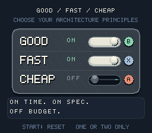

# GFC

**Good / Fast / Cheap** is a tiny native SNES architecture-principles toy. Choose
one or two switches and enjoy the inevitable engineering commentary.



## Play

The playable ROM is **`build/gfc.sfc`**. Open it in Mesen, Snes9x, or bsnes.
This checkout includes Mesen at `.tools/mesen/Mesen.exe`.

```powershell
powershell -ExecutionPolicy Bypass -File scripts/open-tool.ps1 -Tool Mesen -Rom build/gfc.sfc
```

| SNES button | Action | Initial Mesen keyboard mapping |
| --- | --- | --- |
| X | Toggle FAST | X |
| A | Toggle CHEAP | A |
| B | Toggle GOOD | B |
| START | Reset to FAST + GOOD | Enter |

The mapping badges appear beside the corresponding rails. White rails and knobs
mean ON; dark rails and gray knobs mean OFF. Knobs slide between positions.
Holding a button does not repeat. Map a controller through Mesen's SNES input
settings if desired; Batocera uses its own controller configuration.

## Build the game

Run in PowerShell from this folder:

```powershell
powershell -ExecutionPolicy Bypass -File scripts/build.ps1 -Clean
```

The build produces `gfc.sfc` and copies it and its debugger symbols into `build/`.
Expect a **262,144-byte (256 KiB) headerless LoROM**, NTSC, with no SRAM, BIOS, or
special cartridge chips. The compiler, assembler, linker, and audio converter
come from PVSnesLib. Build errors propagate to the script.

For Linux/macOS with PVSnesLib installed, set `PVSNESLIB_HOME` to the SDK directory
and run `make`. On Windows, use the script or an MSYS2 UCRT64 shell. Example:

```bash
export PVSNESLIB_HOME=/c/github/vme/GFC/.tools/pvsneslib/pvsneslib
make
```

The SDK and project paths must not contain spaces. Python is only needed when
regenerating assets; all required generated art and comment data are included.

## Source, assets, and comments

- [src/main.c](src/main.c): display, animated knobs, X/A/B edges, reset, and sound.
- [src/game.c](src/game.c): state transitions and frame-timed pseudo-random generator.
- [src/assets.asm](src/assets.asm): graphics included in the ROM.
- [assets/comments.json](assets/comments.json): all **144 unique comments**, 24 for each state.
- [docs/comments.md](docs/comments.md): the complete list grouped by state.
- [src/comments.h](src/comments.h): generated fixed-size comment arrays.
- [tools/generate_assets.py](tools/generate_assets.py): reproducible original art, font,
  palette, preview, effects, and comment generation; Python standard library only.

To edit comments, change the JSON and regenerate before compiling:

```powershell
python tools/generate_assets.py
powershell -ExecutionPolicy Bypass -File scripts/build.ps1
```

If `python` points to the Windows Store alias, use the installed executable:

```powershell
& "$env:LOCALAPPDATA/Programs/Python/Python313/python.exe" tools/generate_assets.py
```

Art is original pixel drawing inspired by the supplied reference's layout:
rounded, stippled panel; GOOD, FAST, CHEAP down the left; sliders down the right.
The photograph is not embedded in the ROM. The original 5x7 font and all drawing
rules are in the generator. `.pic`, `.map`, and `.pal` files are native SNES tile,
tilemap, and RGB555 palette data. No third-party art or fonts are required.

The generator synthesizes three short 8kHz pulse sounds into `assets/effects.it`:
a rising click, a low rejection buzz, and a descending replacement chirp.
PVSnesLib's `smconv` packs these into `assets/soundbank.bnk`. Samples are preloaded
into SPC700 RAM at startup, so playback does not stall the input loop.

Background music starts automatically using a 12.96-second phrase from the supplied
“Curb Your Enthusiasm Theme (8 Bit Version).mp3”. It repeats continuously, including
when START resets the switches. The phrase is converted to 6 kHz mono to fit the
SNES's 64 KiB audio memory alongside the driver and effects. This softens the
high frequencies; the full 132-second recording is not included.

`assets/music.it` contains the converted loop; `assets/music.json` records its
conversion settings. Ordinary builds need no original MP3. To regenerate it:

```powershell
& "$env:LOCALAPPDATA/Programs/Python/Python313/python.exe" -m pip install --target .tools/python-packages miniaudio numpy
& "$env:LOCALAPPDATA/Programs/Python/Python313/python.exe" tools/import_music.py "$env:USERPROFILE/Downloads/Curb Your Enthusiasm Theme (8 Bit Version).mp3"
powershell -ExecutionPolicy Bypass -File scripts/build.ps1
```

The importer also writes a two-loop WAV preview to `build/music-loop-preview.wav`.
The music occupies DSP voice 0, leaving other voices available for button effects.

## Rules and random selection

The state is a three-bit mask: FAST=1, CHEAP=2, GOOD=4. Its only stored values are
1 through 6. Startup and START select FAST + GOOD (5).

Turning OFF an active switch succeeds if another switch stays ON. Turning OFF
the last one is rejected without changing the mask, with a buzz and a rejection
comment. Turning ON a second switch simply adds it. Turning ON a third chooses
one of the two previously active bits to remove, and commits the final valid
mask in one assignment. The newly selected switch remains ON.

A nonzero 16-bit xorshift generator advances each frame and whenever randomness
is requested. Button timing therefore changes the random sequence. A random bit
selects one of the two previous switches with approximately equal probability.
Powering on and replaying identical frame timing gives the same sequence; this
is intentional pseudo-randomness. START resets the switches, not the generator.

Each successful toggle selects a comment from the new state's pool. The six
fixed-size arrays have 24 entries each, already wrapped to at most two lines of
28 characters. Rejection sampling avoids the usual modulo-24 selection bias.
Rejection messages remain until the next accepted change or reset. Simultaneous
button edges are processed in X, A, B order; START takes priority.

## SNES design adjustments

The screen is 256x224 in Mode 1 with a 16-color static background, a separate
tile layer for rail states and text, and three 16x16 knob sprites. The font uses
uppercase pixel glyphs for reliable readability. Each comment stays within two
28-character lines. The subtitle is “Choose your Architecture Principles”;
the earlier “Pick Two” and “Two Picks. One Catch.” captions are removed.

Static art uploads while the screen is blank. Runtime text DMA is limited to
2 KiB during VBlank; the library's VBlank handler transfers sprite positions.
Knobs move four pixels per frame, completing a slide in eight frames. Rapid
presses retarget the animation without delaying the logical state change.

## Verify the ROM

```powershell
powershell -ExecutionPolicy Bypass -File scripts/test-rom.ps1
```

The Mesen Lua test drives the shipping ROM with real SNES controller input. It
checks startup, all 18 state/button transitions, correct comment pools and text,
holding, rejection, reset, 42 simultaneous button combinations, and 240 random
replacement trials. It also observes SPC700 DSP playback for distinct effects
and verifies that background music stays active through two complete loops.
Results go to `build/verification.txt`; emulator screenshots go to
`build/screenshots/`. Test-time Lua file access is process-local and is not saved
to your emulator settings.

Mesen is the emulator used for automated verification. Snes9x/bsnes and Batocera
playback should be checked on the intended machine; they have not been validated
here.

## Development tools

- [PVSnesLib 4.6.0](https://github.com/alekmaul/pvsneslib/releases/tag/4.6.0): C compiler, 65816/SPC700 assemblers, linker, SNES library, examples, graphics conversion (`gfx4snes`), map conversion (`tmx2snes`), and audio conversion (`smconv`). Installed in `.tools/pvsneslib/pvsneslib`.
- [MSYS2](https://www.msys2.org/) with GNU Make: Windows build environment, installed in `C:/msys64`.
- [Mesen 2.1.1](https://github.com/SourMesen/Mesen2/releases/tag/2.1.1): SNES emulator and debugger, installed in `.tools/mesen`.
- [LibreSprite 1.3](https://github.com/LibreSprite/LibreSprite/releases/tag/v1.3): pixel art and sprite animation, installed in `.tools/libresprite`.
- [Tiled](https://www.mapeditor.org/): level and tilemap editor.
- [OpenMPT](https://openmpt.org/): music and sound authoring. Save music as Impulse Tracker (`.it`) for PVSnesLib's SNESMOD converter; observe SNES sample-memory and channel limits.
- Python 3.13: optional asset regeneration; installed for this project.
- Git and VS Code were already installed.

Portable tools and build outputs are ignored by Git. Keep `.tools` when using this checkout. The SDK environment variable is configured by the build script, so there is no need to change the system PATH.

## Verify the compiler

The build script copies the SDK's Hello World source to `build/hello-world` on its first run.
From PowerShell in this folder:

```powershell
powershell -ExecutionPolicy Bypass -File scripts/build-sample.ps1
powershell -ExecutionPolicy Bypass -File scripts/open-tool.ps1 -Tool Mesen -Rom build/hello-world/hello_world.sfc
```

To open an asset editor, run `scripts/open-tool.ps1` with `-Tool LibreSprite`, `-Tool Tiled`, or `-Tool OpenMPT`.

For manual builds, use an MSYS2 UCRT64 shell with `PVSNESLIB_HOME=/c/github/vme/GFC/.tools/pvsneslib/pvsneslib`, then run `make` in the project directory. The SDK path must not contain spaces. See the [official installation guide](https://github.com/alekmaul/pvsneslib/wiki/Installation).

## Batocera

Copy the generated `.sfc` ROM into `/userdata/roms/snes` on Batocera (or `\\BATOCERA\share\roms\snes` through the Windows network share), then update the game list. See [Batocera's SNES documentation](https://wiki.batocera.org/systems:snes).

PVSnesLib and its bundled SNESMOD runtime retain their respective upstream
licenses. See the license files in `.tools/pvsneslib/pvsneslib/pvsneslib`.
